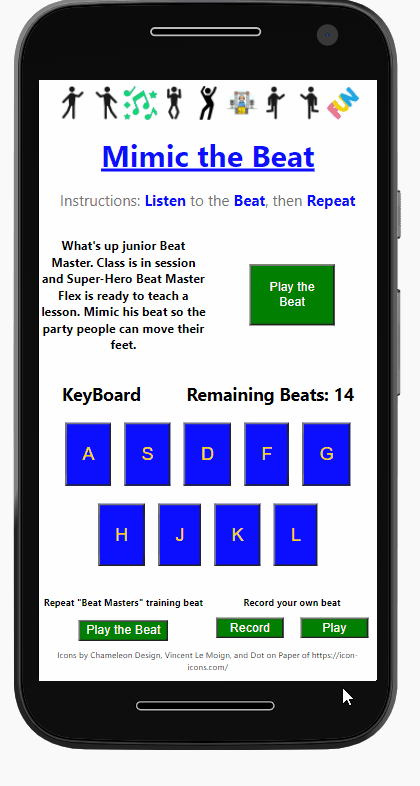
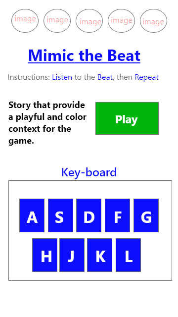

# Mimic Game

### Table of Contents

1. Purpose
2. Motivation
3. Wireframe
4. How to play
5. Technologies Used

### Purpose:

Kids beats game that allow them to either mimic the beat played from the recording or to record a free-style beat.

### Motivation:

The goal was to practice building apps in shorter time periods with React. Really enjoyed using colors, sounds, and icons to animate the app. Wes Bos's JavaScript 30 music tutorial was use as inspiration. 

### WireFrame

### How to play:

- User will click the play button to listen to the recorded beat. Then the user will click on a beat to play a sound
- User will click on the free-style button to allow the option to record beats played by user. 

### This app was built with the following technologies:

**React:** JavaScript front-end library for building user interfaces

**Git-Hub:** Web-based version control repository and Internet hosting service

**Abode XD** A wire-framing tool used to create a mockup/visual of what is to be coded

**JavaScript:** Object-oriented programming language for web pages

**HTML:** Mark-up language for creating web pages

**CSS:** A formatting language for styling web pages

_Created by JC Smiley in November of 2020_
